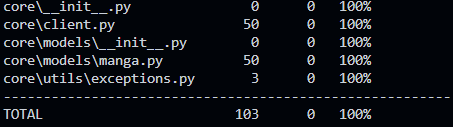

# MANGA SCRAPER

Hey ! This is a little project i made in order to scrap the RSS feed from [MangaSee](https://mangasee123.com/).
It also allows you to download the scan 😎

- [MANGA SCRAPER](#manga-scraper)
  - [Installation](#installation)
  - [Coverage](#coverage)
  - [Command](#command)
  - [Workflow](#workflow)
    - [Get manga info](#get-manga-info)
    - [Download chapter images](#download-chapter-images)


## Installation

If you feel like the project needs something more, feel free to pull and dev ! Here's how to (but i guess you already know how to do) !

```bash
C:/Users/you> git clone https://www.github.com/jordan95v/manga_scraper
C:/Users/you> cd manga_scraper
C:/Users/you/manga_scraper> py -m venv venv
C:/Users/you/manga_scraper> venv/Scripts/activate # venv\bin\activate on Mac
(venv) C:/Users/you/manga_scraper> pip install -r requirements.txt -r requirements-dev.txt
```

And you're set to go !

## Coverage

Here is the `pytest` code coverage:



## Command

I also built some custom commands so you can use the package easily !

Just run `python main.py <command>` :
- `dl-all` to download all the chapters of a manga.
- `dl-chapter` to dl a specific chapter of a manga.

Either way prompt are gonna shows up, or you can just give arguments, just run `python main.py <command> --help` to have further information.

## Workflow

So you ever wanted to download scan from [MangaSee](https://mangasee123.com/) ? I got you 🤩 !

### Get manga info

In order to download a chapter, you first needs to get the information of the manga from the RSS feed.

```python
import asyncio
from core.client import Client
from core.models.manga import Manga


async def main() -> None:
    async with Client() as client:
        res: Manga = await client.get_manga_info("Naruto")
        print(res.title) # Naruto

if __name__ == "__main__":
    asyncio.run(main())
```

### Download chapter images

Now that we got our hand on the manga's info, we can download the chapters.
It will come in the form of a zipfile.

```python
import asyncio
from core.client import Client
from core.models.manga import Manga


async def main() -> None:
    async with Client() as client:
        res: Manga = await client.get_manga_info("One Piece")
        output: Path = Path('One Piece')
        output.mkdir(exists_ok = True)
        await client.download_images(output, res.chapters[0], limit=25)

if __name__ == "__main__":
    asyncio.run(main())
```

⚠️ The parameter `limit` is here to limit the number of images downloaded at the same time. 
If the number is high, your connection might not be enought and the script will raise an error !
So yu might lower it down, but if you got a fast connection, it's clown fiesta ! ⚠️
